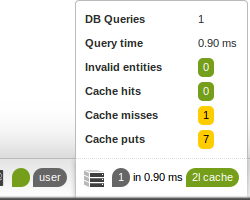
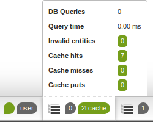

#14 Tips & tricks

We are going to be working on the repository that you have created up to this point. If you skipped
ahead, don't worry. You can clone the repository from its Github repository.

````bash
git clone git@github.com:symfony-tutorial/app.git
git clone git@github.com:symfony-tutorial/store.git
````

Don't forget to `composer install`

Every section's code is in a separate branch with the section's number. So to get the code for the first section of this chapter, just `git checkout 14.1`

<br/><br/><br/><br/><br/><br/><br/><br/><br/><br/><br/><br/><br/><br/><br/>
<br/><br/><br/><br/><br/><br/><br/><br/><br/><br/><br/><br/><br/><br/><br/>

## 14.1 Override a custom Twig filter

When we designed our database, we agreed to save money values as integers representing cents of the currency. This implies that we should divide the stored amount by 100 when showing it to human users.

Let's take a look again at **src/AppBundle/Resources/views/Document/Common/product-line.html.twig**

````html
<tr>
    <td>{{productLine.code}}</td>
    <td>{{productLine.title}}</td>
    <td>{{productLine.price|localizedcurrency(currency)}}</td>
    <td>{{productLine.quantity}}</td>
    <td>{{productLine.total|localizedcurrency(currency)}}</td>
</tr>
````

We will override the **localizedcurrency** Twig filter to always divide the value parameter by 10.

- Create **src/AppBundle/Twig/Extension/Intl.php**

````php
<?php

namespace AppBundle\Twig\Extension;

class Intl extends \Twig_Extensions_Extension_Intl
{

    public function getFilters() {
        return array_merge(parent::getFilters(), array(
            new \Twig_SimpleFilter(
                    'localizedcurrency', array($this, 'localizedCurrencyFilter')
            )
        ));
    }

    public function localizedCurrencyFilter
    ($number, $currency = null, $locale = null, $forceDefault = false) {
        if (!$forceDefault) {
            $number /=100;
        }
        return twig_localized_currency_filter($number, $currency, $locale);
    }

}
````

- Edit **app/config/config.yml** change **twig.extension.intl** class from `Twig_Extensions_Extension_Intl` to `AppBundle\Twig\Extension\Intl`

<br/><br/>
## 14.2 Decorate the translation service

We are requested to create new types of newsletters, christmas, and summer vacation. Right after capturing the business requirements, we ended up with the following translations in **src/AppBundle/Resources/translations/email.en.yml**

````
newsletter_christmas:
    subject: Merry christmas %customer_name%
    from: newsletter@site.com

newsletter_new_year:
    subject: Happy new year %customer_name%
    from: newsletter@site.com

newsletter_summer_vacation:
    subject: Are you ready for vacations %customer_name%?
    from: newsletter@site.com
````

The **from** duplication is obvious here, moreover, if we will need to change the sender, we will have to change it in many places. I would like to have the translations look like this:

````
default_newsletter_sender: newsletter@site.com
newsletter_christmas:
    subject: Merry christmas %customer_name%
    from: @default_newsletter_sender

newsletter_new_year:
    subject: Happy new year %customer_name%
    from: @default_newsletter_sender

newsletter_summer_vacation:
    subject: Are you ready for vacations %customer_name%?
    from: @default_newsletter_sender
````

Unfortunately, this feature is not supported by the Symfony translation component. We will need to override the translator service to add it.

This time, we will introduce some TDD (Test Driven Development) The concept is very simple, don't write any new code until you have at least one failing test. Let's start by writing our first test.

- Create **src/AppBundle/Tests/Service/TranslatorTest.php**

````php
<?php

namespace AppBundle\Tests\Controller;

use Symfony\Bundle\FrameworkBundle\Test\WebTestCase;

class TranslatorTest extends WebTestCase
{

    public function setUp() {
        static::bootKernel();
    }

    public function testTranslate() {
        $translator = static::$kernel->getContainer()->get('translator.default');
        $from = $translator->trans('confirmation.from', array(), 'email', 'en');
        $this->assertEquals('orders@site.com', $from);
    }

}
````

We will use phpunit for unit tests, to run this test, run

````bash
$ phpunit -c app src/AppBundle/Tests/Service/TranslatorTest.php
PHPUnit 3.7.28 by Sebastian Bergmann.

Configuration read from /home/ubuntu/web/symfony-tutorial/app/phpunit.xml.dist

.

Time: 168 ms, Memory: 4.25Mb

OK (1 test, 1 assertion)
````

Next step, is to write the test that asserts our desired behaviour. Edit **TranslatorTest.php** and add the following test.

````
public function testTranslateWithReference() {
    $translator = static::$kernel->getContainer()->get('translator.default');
    $from = $translator->trans('newsletter_christmas.from', array(), 'email', 'en');
    $defaultFrom = $translator->trans('default_newsletter_sender', array(),'email','en');
    $this->assertEquals($defaultFrom, $from);
}
````

Let's run the test again

````
$ phpunit -c app src/AppBundle/Tests/Service/TranslatorTest.php
PHPUnit 3.7.28 by Sebastian Bergmann.

Configuration read from /home/ubuntu/web/symfony-tutorial/app/phpunit.xml.dist

.F

Time: 229 ms, Memory: 4.50Mb

There was 1 failure:

1) AppBundle\Tests\Controller\TranslatorTest::testTranslateWithReference
Failed asserting that two strings are equal.
--- Expected
+++ Actual
@@ @@
-'newsletter@site.com'
+'@default_newsletter_sender'

/home/ubuntu/web/symfony-tutorial/src/AppBundle/Tests/Service/TranslatorTest.php:24

FAILURES!
Tests: 2, Assertions: 2, Failures: 1.
````

Now we have set a specific goal, our implementation is done when **testTranslateWithReference** will succeed.

- Create **src/AppBundle/Service/Translator.php**

````php
<?php

namespace AppBundle\Service;

use Symfony\Component\Translation\TranslatorBagInterface;
use Symfony\Component\Translation\TranslatorInterface;

class Translator implements TranslatorInterface, TranslatorBagInterface
{

    /**
     *
     * @var TranslatorInterface
     */
    private $translator;

    function __construct(TranslatorInterface $translator) {
        $this->translator = $translator;
    }

    public function trans($id, array $parameters = array(), $domain=null, $locale=null) {
        $translated = $this->translator->trans($id, $parameters, $domain, $locale);
        if (strpos($translated, '@') === 0) {
            $id = substr($translated, 1);
            $translated = $this->translator->trans($id,$parameters,$domain,$locale);
        }
        return $translated;
    }

    public function __call($name, $arguments) {
        return call_user_func_array(array($this->translator, $name), $arguments);
    }

    public function getLocale() {
        return $this->translator->getLocale();
    }

    public function setLocale($locale) {
        return $this->translator->setLocale($locale);
    }

    public function transChoice
    ($id, $number, array $parameters = array(), $domain = null, $locale = null) {
        return $this->translator->transChoice($id,$number,$parameters,$domain,$locale);
    }

    public function getCatalogue($locale = null) {
        return $this->translator->getCatalogue($locale);
    }

}
````

- Edit **src/AppBundle/Resources/config/services.yml** and add the following service definition.

````
app.translator:
    class: AppBundle\Service\Translator
    decorates: translator.default
    arguments: ["@app.translator.inner"]
    public: false
````
<br/><br/>
## 14.3 Custom translation loader

We just got new requirements. We need the email related translations to be saved in MySQL database. So we will need to get rid of **src/AppBundle/Resources/translations/email.en.yml** and have those translations in the database. So go ahead and delete that file.

First, let's create the translations table and populate it with initial data.

````sql
CREATE TABLE `translation_message` (
  `id` int(11) NOT NULL AUTO_INCREMENT,
  `key` varchar(255) DEFAULT NULL,
  `locale` varchar(2) DEFAULT NULL,
  `value` longtext,
  `domain` varchar(255) DEFAULT NULL,
  PRIMARY KEY (`id`)
);

INSERT INTO `symfony`.`translation_message` (`key`, `locale`, `value`, `domain`)
VALUES ('default_newsletter_sender', 'en', 'newsletter@site.com', 'email');
INSERT INTO `symfony`.`translation_message` (`key`, `locale`, `value`, `domain`)
VALUES ('confirmation.text', 'en',
'Thank you %customerName%, your order number %orderNumber% is being processed.', 'email');
INSERT INTO `symfony`.`translation_message` (`key`, `locale`, `value`, `domain`)
VALUES ('confirmation.subject', 'en', 'Order confirmation', 'email');
INSERT INTO `symfony`.`translation_message` (`key`, `locale`, `value`, `domain`)
VALUES ('confirmation.from', 'en', 'orders@site.com', 'email');
INSERT INTO `symfony`.`translation_message` (`key`, `locale`, `value`, `domain`)
VALUES ('newsletter_christmas.subject', 'en', 'Merry christmas %customer_name%', 'email');
INSERT INTO `symfony`.`translation_message` (`key`, `locale`, `value`, `domain`)
VALUES ('newsletter_christmas.from', 'en', '@default_newsletter_sender', 'email');
INSERT INTO `symfony`.`translation_message` (`key`, `locale`, `value`, `domain`)
VALUES ('newsletter_new_year.subject', 'en', 'Happy new year %customer_name%', 'email');
INSERT INTO `symfony`.`translation_message` (`key`, `locale`, `value`, `domain`)
VALUES ('newsletter_christmas.from', 'en', '@default_newsletter_sender', 'email');
INSERT INTO `symfony`.`translation_message` (`key`, `locale`, `value`, `domain`)
VALUES ('newsletter_summer_vacation.subject', 'en',
  'Are you ready for vacations %customer_name%?', 'email');
INSERT INTO `symfony`.`translation_message` (`key`, `locale`, `value`, `domain`)
VALUES ('newsletter_summer_vacation.from', 'en', '@default_newsletter_sender', 'email');
````

Next, we need to create the corresponding entity.
- Create **src/AppBundle/Entity/TranslationMessage.php**

````php
<?php

namespace AppBundle\Entity;

use Doctrine\ORM\Mapping as ORM;

/**
 * Vendor
 *
 * @ORM\Table(name="translation_message")
 * @ORM\Entity
 */
class TranslationMessage
{

    const REPOSITORY = 'AppBundle:TranslationMessage';

    /**
     * @var integer
     *
     * @ORM\Column(name="id", type="integer", nullable=false)
     * @ORM\Id
     * @ORM\GeneratedValue(strategy="IDENTITY")
     */
    private $id;

    /**
     * @var string
     *
     * @ORM\Column(name="key", type="string", nullable=true)
     */
    private $key;

    /**
     * @var string
     *
     * @ORM\Column(name="locale", type="string", length=2, nullable=true)
     */
    private $locale;

    /**
     * @var string
     *
     * @ORM\Column(name="value", type="text", nullable=true)
     */
    private $value;

    /**
     * @var string
     *
     * @ORM\Column(name="domain", type="string", nullable=true)
     */
    private $domain;


    function getId() {
        return $this->id;
    }

    function getKey() {
        return $this->key;
    }

    function getLocale() {
        return $this->locale;
    }

    function getValue() {
        return $this->value;
    }

    function getDomain() {
        return $this->domain;
    }

    function setKey($key) {
        $this->key = $key;
    }

    function setLocale($locale) {
        $this->locale = $locale;
    }

    function setValue($value) {
        $this->value = $value;
    }

    function setDomain($domain) {
        $this->domain = $domain;
    }

}
````

- Create **src/AppBundle/Translation/DoctrineLoader.php**

````php
<?php

namespace AppBundle\Translation;

use AppBundle\Entity\TranslationMessage;
use Doctrine\ORM\EntityManager;
use Symfony\Component\Translation\Loader\LoaderInterface;
use Symfony\Component\Translation\MessageCatalogue;

class DoctrineLoader implements LoaderInterface
{

    /**
     *
     * @var EntityManager
     */
    private $manager;

    function __construct(EntityManager $manager) {
        $this->manager = $manager;
    }

    public function load($resource, $locale, $domain = 'messages') {
        $repository = $this->manager->getRepository(TranslationMessage::REPOSITORY);
        $messages = $repository->findBy(array('locale' => $locale));
        $catalogue = new MessageCatalogue($locale);
        $translations = array();
        foreach ($messages as $message) {
            $translations[$message->getKey()] = $message->getValue();
        }
        $catalogue->add($translations, $domain);
        return $catalogue;
    }

}
````

- Edit **app/config/config.yml** and add the following service definition

````
app.translation.doctrine_loader:
    class: AppBundle\Translation\DoctrineLoader
    arguments: [@doctrine.orm.default_entity_manager]
    tags:
        - {name: 'translation.loader', alias: 'doctrine'}
````

- Create an empty file **app/Resources/translations/email.en.doctrine**

<br/><br/><br/><br/>

## 14.4 Doctrine second level cache

Browse http://symfony.local/app_dev.php/country/ and inspect the Doctrine tab in the profiler. You will see the query `SELECT t0.id AS id_1, t0.code AS code_2, t0.name AS name_3, t0.currency AS currency_4 FROM country t0`

The countries list won't change very often. To avoid querying the database every time, we can configure a second level cache for the Country entity.

- Edit **app/config/doctrine.yml**, under doctrine.orm add
````
second_level_cache:
    regions:
        app:
            cache_driver: redis
````

- Edit **src/AppBundle/Entity/Country.php** and add `@ORM\Cache(usage="READ_ONLY", region="app"` to the entity annotations.

Done, let's browse http://symfony.local/app_dev.php/country/ again, notice the new 2l cache tab in the profiler.



refresh the page and inspect the profiler again



<br/><br/>
## 14.5 Exercises

1. Create an asynchronous event. When an asynchronous event is dispatched, serialize it and publish it to the **event** exchange with the **event** routing key.  
Create an event consumer that will dispatch the event after flagging it as redispatched.
2. Add an encryptable asynchronous even. So the event will be encrypted before being be published to the exchange.
3. Let the user define their own encryption/decryption service.
